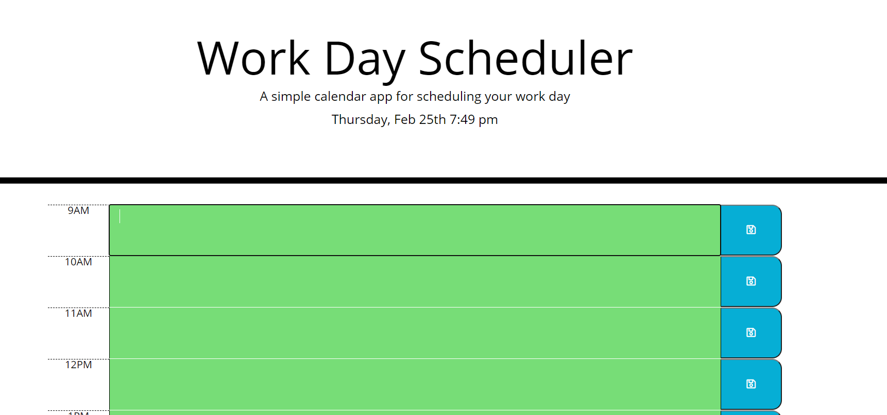

# Third_Party_APIs 

 Here you will find a simple work day calendar that captures the current date and time upon opening. Allows the user to enter events by time block and save them. Events will be saved after refreshing window. Time blocks are also color coded for the current hour, past hour(s) and future hour(s). 
 Hopefully this can help simplify your day!

 Deployed site: https://jess20005.github.io/Third_Party_APIs/

 GitHub repo:https://github.com/Jess20005/Third_Party_APIs
 